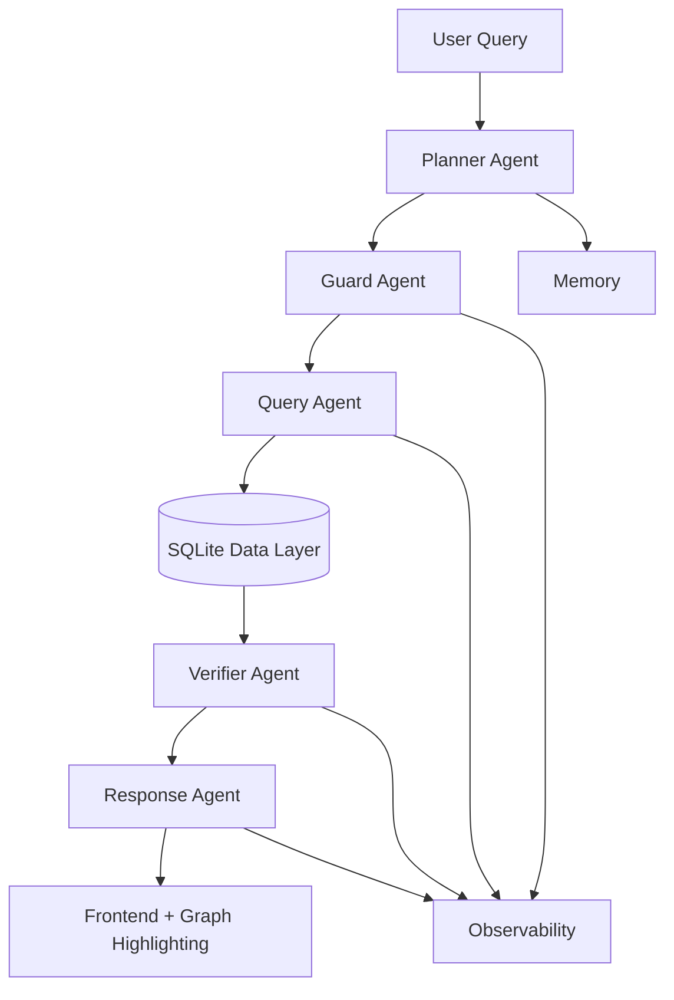
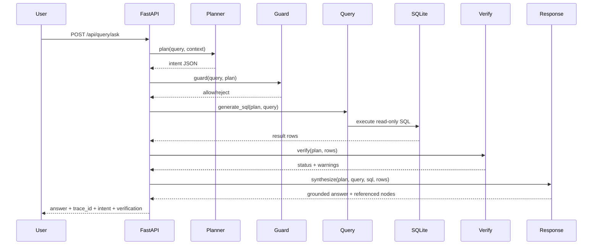

# O2C Graph Intelligence — Architecture Overview

## System Positioning
This project is an **Agentic Business Intelligence System** for SAP Order-to-Cash analytics.  
It follows a strict separation of planning, execution, verification, and response synthesis.

## Product UX Principles
- Clarity over features
- Determinism over magic
- Progressive disclosure
- One primary action per surface

## Frontend Surfaces
- `/` Landing: concise product story, trust framing, single CTA
- `/workspace` Workspace: graph intelligence + query assistant with trace-on-demand

## 3-Layer Architecture (User → Agents → Data)
1. **User Layer**: React graph + chat UI
2. **Agent Layer**: Planner, Guard, Query, Verifier, Response, Memory, Observability
3. **Execution/Data Layer**: DB adapter (SQLite/Postgres) + read-only query engine + NetworkX graph model

## Agent Responsibility Matrix
| Agent | Responsibility | Input | Output |
|---|---|---|---|
| Planner | NL intent extraction and follow-up resolution | user query + context | `{intent, entity_type, entity_id, follow_up}` |
| Guard | Domain and policy enforcement | query + plan | allow/reject + reason |
| Query | Deterministic SQL templates only (no LLM SQL generation) | plan + query | SQL string |
| Verifier | Result sanity checks | plan + result rows | `{status, warnings}` |
| Response | Grounded explanation + node references | plan + SQL + rows | answer text + referenced nodes |
| Memory | Store minimal conversation context | conversation id + plan | latest context |
| Observability | Structured trace logs | stage event payloads | trace timeline |

## Reason → Act → Verify Pipeline

## Data Plane
1. JSONL ingestion into SQLite tables.
2. Normalization + reject artifact generation.
3. NetworkX graph materialization for exploration APIs.
4. Query execution remains read-only and schema-guarded.

## API Endpoints
- `GET /api/health`
- `GET /api/agents/status`
- `POST /api/query/ask`
- `GET /api/query/trace/{trace_id}`
- `GET /api/graph/overview`
- `GET /api/graph/node/{node_id}`
- `GET /api/graph/node/{node_id}/neighbors`

## Reliability Controls
- Off-domain rejection and intent-policy checks
- SQL safety validation and table whitelist enforcement
- DB adapter boundary for backend portability (SQLite default, Postgres ready)
- Response grounding checks against result IDs
- Structured per-stage tracing for auditability
